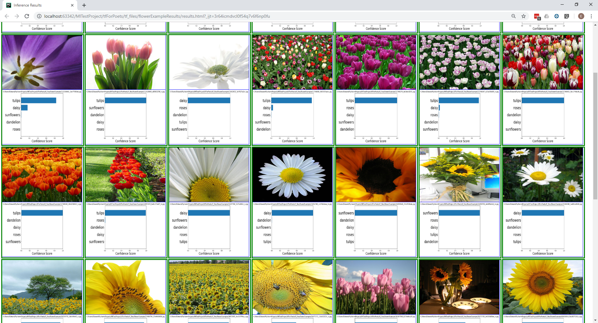

# imageClassifierResultsViewer
generates a html page with images and confidence scores from an image classifier

#inputs
    resultsDict: {'imageName.jpg':['imagePath',processTime,categoryN,confidenceN..categoryN-1, confidenceN-1],...}
    resultsDir: the path and name of the results folder
    
#outputs
    An html file with the process image and generated confidence score bar graph
    
#example
    screenshot of generated results report for tf for poets flowers classifier
    
